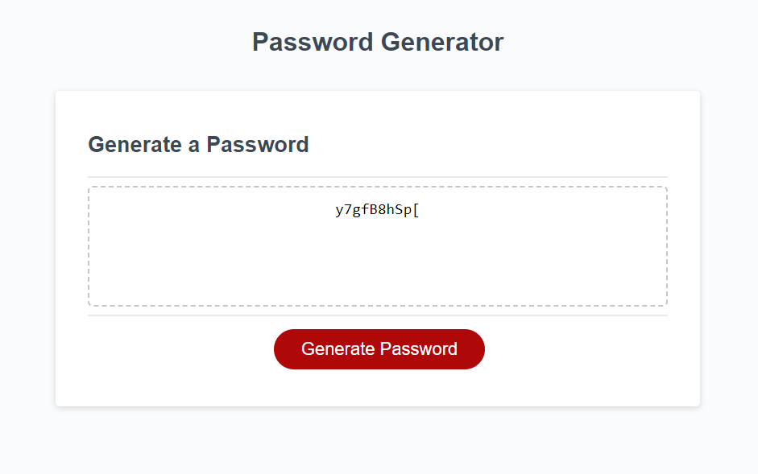

# Passord Generator

## Description

This program will generate a password based on the information that a user feeds it. A user will be able to generate a password with a character limit between 8-128. The program will also ask the user if they would like capital, lowercase, numbers or special characters in the generated password. Clicking okay on any of those questions will guarantee at least one character in the password will be a selected character. Selecting cancel on a prompt will mean that specific character type will not be in the password. The program will only generate a password when only one prompt is checked.
## Installation

link to the cite: https://nhatwin.github.io/hw-3/

## Usage

This program can be used to generate a random password based on a user's input. The program is useful for when a user needs a random password which is much harder to guess that they can use in other web applications. The program will also allow users to customize there password incase they need specific characters such as, lowecase, capital, numeric or special characters inm there password.

## Screenshot

## Credits

N/A

## License

Please refer to the LICENSE in the repo.